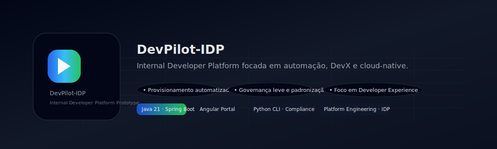

<p align="center">
  
</p>

# DevPilot-IDP – Internal Developer Platform Prototype

DevPilot-IDP é um protótipo de Internal Developer Platform (IDP) projetado para demonstrar como uma plataforma de engenharia pode acelerar a jornada do desenvolvedor, garantindo autonomia, governança, provisionamento inteligente, padronização técnica e operabilidade desde o primeiro deploy.

A proposta central é simular, em escala reduzida, o funcionamento de um *Developer Control Plane* que integra:

- Solicitação de criação de novos serviços;
- Execução de fluxos de provisionamento automatizado;
- Registro e acompanhamento de tarefas de infraestrutura;
- Geração de artefatos e templates padronizados;
- Visualização de instâncias e status operacionais;
- Validação automática de padrões e boas práticas de engenharia.

---

## 🚀 Objetivos do DevPilot-IDP

- Aumentar a autonomia do desenvolvedor por meio de autosserviço;
- Diminuir o lead time entre ideia → serviço em execução;
- Reduzir dependência de equipes intermediárias (cloud, segurança, acessos);
- Facilitar troubleshooting com dados de instâncias;
- Criar uma camada de governança leve e padronização;
- Unificar visão de provisionamento, deploy, configuração e operação.

---

## 🏗️ Arquitetura Geral

O DevPilot-IDP é composto por quatro módulos independentes:

---

### **1️⃣ Backend (`backend/`)**

API escrita em **Java 21 + Spring Boot**, responsável por:

- Receber solicitações de criação de serviços;
- Criar fluxo de automação (tarefas simuladas de cloud, segurança, políticas, registro);
- Armazenar logs, status e histórico;
- Expor informações de instâncias e saúde dos serviços;
- Disponibilizar endpoints REST já integrados ao portal.

---

### **2️⃣ Frontend (`frontend/`)**

Portal em **Angular**, permitindo:

- Criar solicitações via formulário;
- Visualizar tarefas de provisionamento;
- Acompanhar histórico e status;
- Visualizar tabela de instâncias (réplicas, CPU, memória, health);
- Ser a interface central do desenvolvedor dentro da plataforma.

---

### **3️⃣ Compliance Scanner (`devpilot-check/`)**

Ferramenta CLI em **Python**, capaz de:

- Ler metadados de serviços;
- Avaliar conformidade técnica (Java 21, Actuator, CI/CD, logs estruturados);
- Gerar relatório de pontuação no terminal;
- Ser integrada em pipelines CI/CD reais.

---

### **4️⃣ Automation & Infra (`automation/` e `infra/`)**

Scripts e artefatos de infraestrutura que simulam:

- Automação do ambiente local;
- Testes automatizados;
- Estruturas de containerização (Dockerfile);
- Manifests Kubernetes;
- Documentação de arquitetura cloud.

---

## 📂 Estrutura do Repositório

DevPilot-IDP/
├── backend/ # API Java 21 + Spring Boot
├── frontend/ # Angular Portal
├── devpilot-check/ # Scanner de compliance
├── automation/ # Scripts DevOps
└── infra/ # Docker, K8s, Cloud docs

---

## 🧪 Executando o Projeto

### **▶️ Backend**
```bash
# Subir a API do DevPilot-IDP em ambiente local
cd backend
mvn spring-boot:run
```

API disponível em:  
http://localhost:8080

---

### **▶️ Compliance Scanner**
```bash
# Executar o scanner de conformidade técnica
cd devpilot-check
python scanner.py sample-metadata.json
```

---

### **▶️ Frontend**
```bash
# Subir o portal Angular do DevPilot-IDP
cd frontend/idp-autopilot-frontend
npm install
npm start
```

Portal disponível em:  
http://localhost:4200


